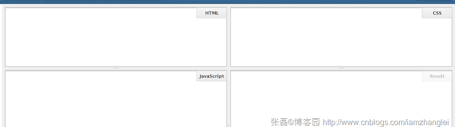
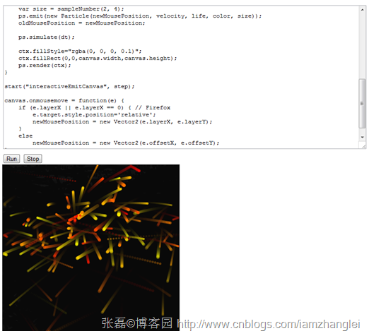
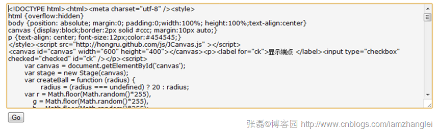

# CnBlogs博文demo演示技巧比较：jsfiddle完胜 #

## 一.简介 ##

如果你是一名前端博主，你希望通过代码+演示来透彻的讲解一些技巧，并且无缝嵌入你的博客，那么jsfiddle是一个很好的选择。

本文将比较博客园前端dev们各种演示方式，大家可以挑选自己喜欢的方式。

 

 

## 二.jsFiddle简介 ##

jsFiddle的官方网站：[http://jsfiddle.net/](http://jsfiddle.net/)

它包括了顶端的控制按钮，如下图：


分别代表：运行、保存、重置、代码格式化，代码语法错误检查

下面的4个windows你可以分别调试HTML，CSS，Javascript，右下角显示代码的运行结果。



在左边的操作区，你可以选择相关的js类库，支持的还是相当全的。当然，也支持自定义的类库，这个很不错。


这个工具可以有效的帮助web前端开发人员来有效分享和演示前端效果，大家可以在blog和论坛里用jsFiddle解答或者提问。

 

 

## 三.demo演示技巧比较 ##

a.[Milo Yip方式](https://www.cnblogs.com/miloyip/archive/2010/06/14/Kinematics_ParticleSystem.html) ，如下图：



首先要在页面引入相关的js库，然后在textarea 里面放入要执行的代码，然后eval(document.getElementById('interactiveEmitCode').value)代码如下：

```
<textarea id="interactiveEmitCode" rows="20" cols="100">
var ps = new ParticleSystem();
ps.effectors.push(new ChamberBox(0, 0, 400, 400));
var dt = 0.01;
····
····
····
····
····
else
newMousePosition = new Vector2(e.offsetX, e.offsetY);
};
</textarea>
<br />
<button onclick="eval(document.getElementById('interactiveEmitCode').value)" type="button">Run</button>
<button onclick="stop();" type="button">Stop</button>
<br />
<canvas id="interactiveEmitCanvas" width="400" height="400"></canvas>
```

优点：可以在本页面编辑代码，并且看到实时效果，

缺点：页面需要引用相关js库，和本页代码逻辑混在一起。代码颜色黑白显示，用户体验差

 

b.[岑安方式](https://www.cnblogs.com/hongru/archive/2011/09/16/2178673.html)和[司徒正美方式](https://www.cnblogs.com/rubylouvre/archive/2011/09/07/2169159.html)，如下图：



 

把代码放到一个iframe中，然后再新开页面执行该页面的代码。相关代码如下：

```
<script type="text/javascript">
function runCode(id) {
obj = document.getElementById(id);
var TestWin=open(''); //打开一个窗口并赋给变量TestWin。
TestWin.opener = null // 防止代码对论谈页面修改
TestWin.document.write(obj.value); //向这个打开的窗口中写入代码code，这样就实现了运行代码功能。
TestWin.document.close();
}
</script>
```

优点：逻辑分离，可以编辑运行。

缺点：需要新开页，代码黑白显示，用户体验差

 

C.外链方式

优点：不与本页html,css,js出现冲突，只要给出外链，不能编辑代码。

缺点：需要想SAE上传相关的js、img、css和html

 


D.jsFiddle方式,我直接拿岑安方式的代码作为例子：效果如下


这里有个小技巧：上面看到的iframe指定的src为http:​/​/​jsfiddle.net/​zhanglei/​QZJGZ/​embedded/​result,js,html,css"

最后的result,js,html,css为iframe中tab的显示的顺序，或者你不想显示html,css,你就可以直接写成

http://jsfiddle.net/zhanglei/LHWmv/embedded/result,js

效果如下：


也可以显示result js和html，效果如下：


 

## 四.总结 ##

比较这四种方式，我最喜欢最后一种，我相信喜欢最后一种的多一些，因为不仅演示的代码和博客的代码分离，html和CSS和js和最终效果也分离开了·

 

## 五.同步 ##

本文已同步更新至：

HTML5实验室【目录】:   http://www.cnblogs.com/iamzhanglei/archive/2011/11/06/2237870.html

参考链接：https://www.cnblogs.com/iamzhanglei/archive/2011/10/07/2199306.html