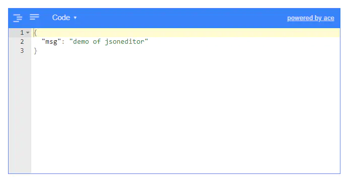

# json编辑器vue-json-editor


安装  
`npm install vue-json-editor --save`  


使用

```html
            <template>
              <div class="jsonEditor">
                <vue-json-editor
                v-model="json"                 :mode="'code'"
                lang="zh"
                @json-change="onJsonChange"
                @json-save="onJsonSave"                 @has-error="onError"></vue-json-editor>
              </div>
            </template>
```

```j
<script>
import vueJsonEditor from 'vue-json-editor'
export default {
  components:{
    vueJsonEditor
  },
  data () {
    return {
      form:{
        code:'3453',
        name:'354'
      },
      json:{
        msg: 'demo of jsoneditor',
      }
    }
  },
  methods: {
    // 数据改变是触发
    onJsonChange (value) {
      console.log('value:', value)
    },
    // 点击保存时触发
    onJsonSave (value) {
      console.log('value:', value)
    },
    onError (value) {
      console.log('value:', value)
    }
  }
}
</script>

<style lang="less" scoped>
  .updateAttributes{
    height: 671px;
    padding: 20px;
    .jsonEditor{
      width: 600px;
      /deep/.jsoneditor-vue{
        height:300px;
      }
    }
  }
</style>
```

效果



image.png

作者：wangxiurong  
链接：https://www.jianshu.com/p/5942a185fb36  
来源：简书  
著作权归作者所有。商业转载请联系作者获得授权，非商业转载请注明出处。
